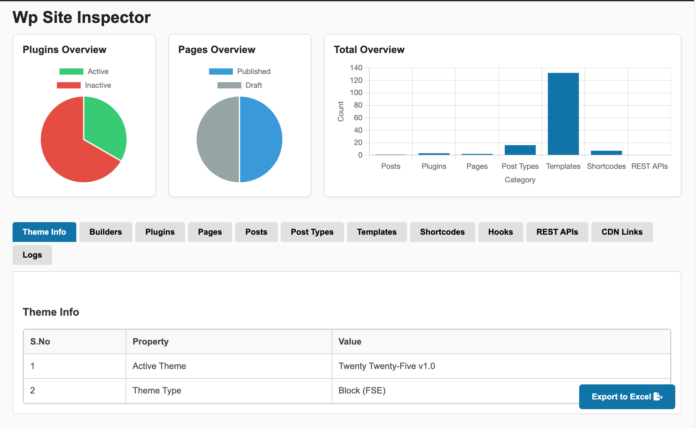

<h1 align="center">🛠️ WP Site Inspector Agent</h1>

  <strong>Your WordPress Debug & Discovery Co-Pilot</strong> 
  <em>Audit themes, plugins, REST APIs, and fix errors with AI — in seconds.</em>

  
  
  
  
  

---

## 📖 Overview

**WP Site Inspector Agent** is an open-source WordPress plugin built for developers, freelancers, and agencies who need **instant, actionable insights** into any WordPress site.

It’s like an x-ray machine for your WordPress stack — exposing everything from shortcodes and hooks to REST APIs, templates, and hidden issues.

> ⚡ No more digging through theme files.  
> 🧠 No more guessing where bugs live.

---

## ✨ Features

- ✅ Scan active/parent themes without setup  
- ✅ Instantly list shortcodes, hooks, templates, post types  
- ✅ Detect REST API calls, CDN links & JS usage  
- ✅ View file paths & line numbers  
- ✅ List all published pages, posts & custom post types  
- ✅ Export reports to `.xls`  
- ✅ Admin-only access with secure design  
- ✅ Fatal error detection + alert emails  
- ✅ Built-in AI chatbot for log analysis (BYOK)  
- ✅ AI-powered log auto-fix  
- ✅ Multilingual UI: 🇬🇧 English, 🇩🇪 German, 🇪🇸 Spanish  

---

## 🚀 Why Use It?

If you've ever said:

- “What’s even happening on this site?”  
- “Where is this shortcode defined?”  
- “Which plugin is breaking the homepage?”  

Then **WP Site Inspector Agent** is made for you.

Perfect for:  
🧑‍💻 Freelancers • 🧪 QA Engineers • 🏢 Agencies • 💡 WP Contributors • 👩‍🎓 Students

---

## 🔍 Use Cases

- 🧩 Auditing undocumented themes & templates  
- 🛠️ Debugging custom features  
- 🔄 Refactoring legacy code  
- 🤝 Creating handoff-ready documentation  
- 📋 Generating a technical site map  

---

## 🤖 AI Code Assistant

> AI chatbot that finds, explains, and fixes errors.

✔️ Ask: “Why did this error happen?”  
✔️ Suggest fixes for deprecated or fatal code  
✔️ Get file-level insights on PHP warnings or notices  
✔️ Understand complex or undocumented functions  
✔️ Get explanations for deprecation notices and warnings  
✔️ Identify which plugin/theme generated the error  
✔️ Copy fix suggestions directly into your theme/plugin  
✔️ Use your own API key (BYOK) for private debugging  

---

### ⚡ AI-powered log auto-fix

**Automatically detect and fix errors directly from logs.**

- Parses your logs for **file names** and **line numbers**  
- Opens affected files and **auto-fixes** issues with LLMs  
- Takes an automatic backup (`.bak`) of the file  
- If anything goes wrong, **auto-restores the original** version  
- Compatible with all major WordPress themes and plugins  
- Handles common errors like undefined variables, missing includes, deprecated functions  
- Displays status updates: Pending, Fulfilled, Failed  
- Works with custom-coded themes and plugins  
- Designed for both novice and advanced developers  

> Powered by your preferred model: OpenAI, Claude, Gemini, DeepSeek, or OpenRouter — via your own API key (BYOK)

**Example Query:**  
`"Undefined variable $undefined_variable (File: /code/wp-content/themes/twentytwentyfive/functions.php Line: 164)"`

---

## 🔐 BYOK (Bring Your Own Key) Support

WP Site Inspector Agent gives you full control over AI usage. In the plugin settings, you can add your own API key and choose from supported providers and models.

**Supported Providers & Models:**

| Provider     | Models |
|--------------|--------|
| `wp-site-inspector` | `WPSI-01` |
| `openai`     | `gpt-4`, `gpt-3.5-turbo` |
| `deepseek`   | `deepseek-chat`, `deepseek-coder`, `deepseek-chat-v3` |
| `anthropic`  | `Claude 3 Opus`, `Claude 3 Sonnet`, `Claude 3 Haiku` |
| `google`     | `Gemini 1.5 Pro`, `Gemini 1.0 Pro` |
| `mistral`    | `Mistral Small`, `Mistral Medium`, `Mistral Large` |
| `openrouter` | `GPT-3.5 Turbo`, `GPT-4`, `DeepSeek Chat v3 (Free)` |

---

### 🆓 Don’t have a key? Use Our Free Model!

You can also use our own hosted model: **WPSI-01**, available under the `wp-site-inspector` provider.

> ✅ We offer limited free access per day.  
> 📧 Just send a request via email to get your personal API key.  
> 🔐 Secure, no vendor lock-in, and completely private.

---

## 🌍 Multilingual Support

- 🇬🇧 English  
- 🇩🇪 German  
- 🇪🇸 Spanish  

UI auto-detects and adapts to your site's language.

---

## 📤 One-Click Export

Export your full scan to `.xlsx` — perfect for:

- 🧪 QA reports  
- 🧾 Client documentation  
- 🔧 Dev handoffs  

---

## 📦 Coming Soon
 
- 🧪 WP-CLI integration  

---

## ⚙️ Installation

1. [Download latest ZIP](https://github.com/prathushan/WP-Site-Inspector/archive/refs/heads/main.zip)  
2. Go to **Plugins → Add New → Upload Plugin**  
3. Install and activate  
4. Start inspecting from the WP Admin menu  

---

## 💡 Why We Built This

Because:

- WordPress sites grow messy — fast  
- Developers waste hours asking “What’s active and why?”  
- Legacy code makes debugging painful  

> This plugin saves time, simplifies audits, and improves team handoffs.

---

## 📬 Contact

- 📧 Email: [prathusha.nammi@gmail.com](mailto:prathusha.nammi@gmail.com)  
- 🐛 Bug reports: [GitHub Issues](https://github.com/prathushan/WP-Site-Inspector/issues)  
- 💡 Feature requests: [GitHub Discussions](https://github.com/prathushan/WP-Site-Inspector/discussions)  

---

## 🙌 Authors

Made with ❤️ by:

- [**Prathusha**](https://github.com/prathushan)  
- [**Prem Kumar**](https://github.com/PremKumar-Softscripts)  
- [**Vinay**](https://github.com/v-i-nay)  

Want to contribute? 👉 [Open a Pull Request](https://github.com/prathushan/WP-Site-Inspector/pulls)

⭐️ If you find this project helpful, please consider [starring the repo](https://github.com/prathushan/WP-Site-Inspector) — it helps others discover it too!

---

## 📄 License

Distributed under the [MIT License](https://choosealicense.com/licenses/mit/).  
Free to use, modify, and distribute with attribution.

---

  <strong>Audit. Analyze. Fix. Repeat.</strong> 
  <em>Built for WordPress developers who demand clarity and control.</em>

